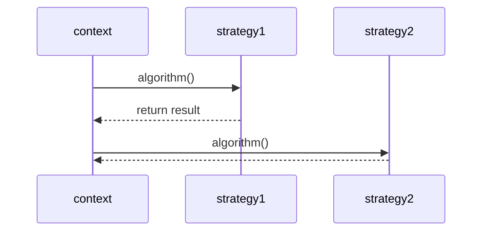

# 전략 패턴(strategy pattern)

### Diagram


### 설명
전략 패턴(strategy pattern)은 정책 패턴(policy pattern)이라고도 하며, 객체의 행위를 바꾸고 싶은 경우 단일 알고리즘을 직접 구현하는 대신 전략이라고 부르는 ‘캡슐화한 알고리즘’을 컨텍스트 안에서 바꿔주면서 상호 교체가 가능하게 만드는 패턴이다.

<!-- ### 사용처
예를 들어, 착신 데이터에 대해 검증을 수행하는 클래스는 데이터 유형, 데이터 소스, 사용자 선택 또는 기타 식별 요소에 따라 전략 패턴을 사용하여 검증 알고리즘을 선택할 수 있다.이러한 요인은 런타임까지 파악되지 않으며 완전히 다른 검증을 수행해야 할 수 있다.검증 개체와는 별도로 캡슐화된 검증 알고리즘(전략)은 코드 복제 없이 시스템의 다른 영역(또는 다른 시스템)에 있는 다른 검증 개체에 의해 사용될 수 있다.

일반적으로 전략 패턴은 데이터 구조의 일부 코드에 대한 참조를 저장하고 검색한다.이는 네이티브 함수 포인터, 퍼스트 클래스 함수, 객체 지향 프로그래밍 언어의 클래스 또는 클래스 인스턴스와 같은 메커니즘에 의해 달성되거나 언어 구현의 내부 코드 스토리지에 리플렉션을 통해 액세스할 수 있다. -->


### 샘플  코드
```dart
abstract class CoffeeStrategy {
  String announce(String roast);
}

class AmericanoStrategy implements CoffeeStrategy {
  String announce(String roast) => "an Americano with $roast beans";
}

class DripStrategy implements CoffeeStrategy {
  String announce(String roast) => "a drip coffee with $roast beans";
}

class MochaFrappuccinoStrategy implements CoffeeStrategy {
  String announce(String roast) => "a delicious mocha frappuccion with $roast beans";
}

class CoffeeDrinker {
  CoffeeStrategy preferredDrink;
  String name;
  CoffeeDrinker(this.name, this.preferredDrink);
}

void main() {
  var americano = AmericanoStrategy();
  var drip = DripStrategy();
  var mocha = MochaFrappuccinoStrategy();

  var me = CoffeeDrinker("Tyler", drip);
  var europeanBuddy = CoffeeDrinker("Pieter", americano);
  var myDaughter = CoffeeDrinker("Joanie", mocha);

  final String roastOfTheDay = "Italian";

  for (var person in [me, europeanBuddy, myDaughter]) {
    print("Hey ${person.name}, whatcha drinkin' over there?");
    print("I'm enjoying ${person.preferredDrink.announce(roastOfTheDay)}!\r\n");
  }

  /*
    Hey Tyler, whatcha drinkin' over there?
    I'm enjoying a drip coffee with Italian beans!
    Hey Pieter, whatcha drinkin' over there?
    I'm enjoying an Americano with Italian beans!
    Hey Joanie, whatcha drinkin' over there?
    I'm enjoying a delicious mocha frappuccion with Italian beans!
  */
}
```