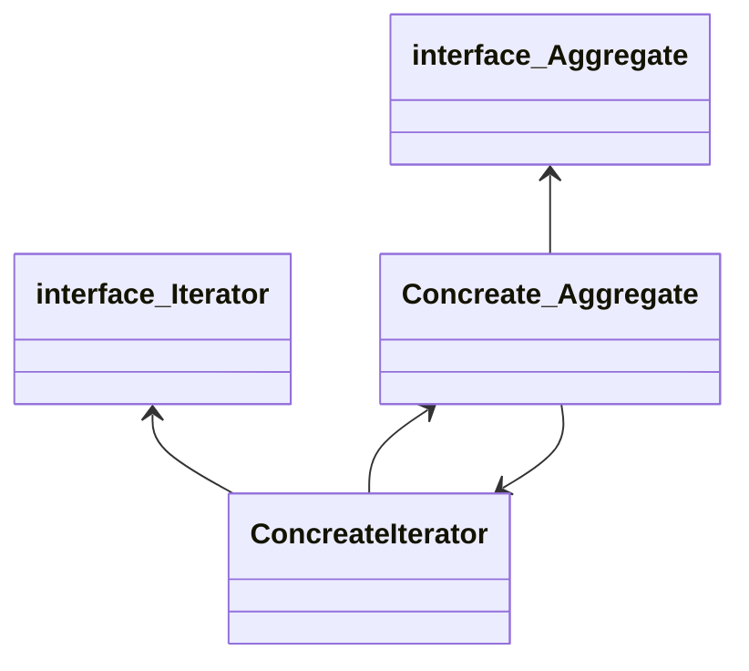

# 이터레이터 패턴(iterator pattern)

### Diagram

### 설명
<!-- 
In object-oriented programming, the iterator pattern is a design pattern in which an iterator is used to traverse a container and access the container's elements. The iterator pattern decouples algorithms from containers; in some cases, algorithms are necessarily container-specific and thus cannot be decoupled.

For example, the hypothetical algorithm SearchForElement can be implemented generally using a specified type of iterator rather than implementing it as a container-specific algorithm. This allows SearchForElement to be used on any container that supports the required type of iterator.
 -->
이터레이터 패턴(iterator pattern)은 이터레이터(iterator)를 사용하여 컬렉션(collection)의 요소들에 접근하는 디자인 패턴이다.
이를 통해 순회할 수 있는 여러 가지 자료형의 구조와는 상관없이 이터레이터라는 하나의 인터페이스로 순회가 가능해진다.

### 단점
복잡한 구조가 필요하지 않은 간단한 응용 프로그램에서 자원의 과잉으로 판명 될 수 있다.
Iterator 메서드를 사용하면 간단한 응용 프로그램이 복잡해진다.
반복자를 사용하여 요소에 액세스하는 것은, 요소에 직접 액세스하는 것보다 효율성이 좋지 않다.

### 샘플  코드
```dart
// NOTE: See https://api.dartlang.org/stable/2.4.0/dart-core/Iterator-class.html
// for details on Dart's Iterator class.

class RainbowIterator implements Iterator {
  var _colors = ["Red", "Orange", "Yellow", "Green", "Blue", "Indigo", "Violet"];
  var _index = 0;
  String get current => _colors[_index++];
  bool moveNext() => _index < _colors.length;
}

void main() {
  var rainbowColors = RainbowIterator();
  while(rainbowColors.moveNext()) {
    print(rainbowColors.current);
  }

  /*
    Red
    Orange
    Yellow
    Green
    Blue
    Indigo
    Violet
  */
}
```